## Early Experience

### 摘要
语言智能体的长期目标是通过自身经验不断学习与改进，最终在复杂、现实世界的任务中超越人类。然而，在许多环境中，依靠经验数据通过强化学习来训练智能体仍然困难重重：这些环境要么缺乏可验证的奖励信号（如网站），要么需要低效的长时程交互（如多轮工具使用）。因此，当前大多数智能体仍依赖专家数据进行监督微调，这种方式难以扩展且泛化能力差。其根本原因在于专家演示本身：它们只覆盖极少数场景，使智能体接触到的环境多样性极其有限。

我们提出一种折中范式——“早期经验”（early experience）——来缓解这一缺陷：让智能体自主生成交互数据，并用由此产生的未来状态作为无需奖励信号的监督。在此范式下，我们研究两种利用此类数据的策略：

- 隐式世界模型：利用收集到的状态将策略锚定在环境动力学中；
- 自我反思：让智能体从自身的次优行为中学习，以改进推理与决策。

我们在八个多样化环境及多个模型系列上进行了评估。实验表明，这两种方法均能持续提升智能体的有效性与跨域泛化能力，凸显了早期经验的价值。此外，在具备可验证奖励的环境中，我们的结果进一步显示：早期经验为后续的强化学习奠定了坚实基础，可作为模仿学习与完全经验驱动智能体之间的实用桥梁。

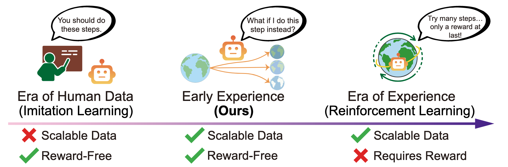

- 左图：“人类数据时代”依赖专家演示，监督信号来自人类/专家精心编排的动作；无需奖励（即环境无需提供可验证的奖励），但数据难以规模化。  
- 右图：设想的“经验时代”建立在具备可验证奖励的环境之上，并以这些奖励作为强化学习的主要监督；然而，许多环境要么缺乏此类奖励（Xue 等，2025），要么需要低效的长时程交互（Xie 等，2024a）。  
- 中间：我们提出的“早期经验”范式，让智能体主动采取行动并收集随之产生的未来状态，将这些状态作为可扩展且无需奖励的监督来源。

### 简介

**RL的问题**
- 许多环境缺乏可验证的/稠密的奖励信号，尤其在开放式场景（网页）中不会提供实际的反馈值
- 在多轮工具使用环境里，任务往往涉及长交互序列，其最终结果滞后且模糊，导致信用分配困难，训练过程低效且不稳定

**SFT的问题**
- agent在训练过程中没有与真实环境进行交互，缺乏从自身行为得到的反馈，这限制了它从自身失败经验中学习，也难以泛化到unseen的场景
- 需要大量的专家经验和标注数据，无法规模化；agent处在被动学习的状态

```如何让agent从其过往经验中学习？```

1. 隐式世界建模：利用收集到的未来状态帮助智能体构建环境动态的内部表示，使其能够通过预测未来状态更好地理解环境。
2. 自我反思：指导智能体将其行为与专家演示进行比较，识别次优决策，并吸取教训以改进未来的决策。

### 相关工作
## 2 相关工作  

### 2.1 语言智能体的训练范式  

- **监督微调（SFT）**  
  - 绝大多数语言智能体（Yao 等，2022；Deng 等，2023；Hong 等，2024；Furuta 等，2024；Pahuja 等，2025）采用 SFT 进行训练，这在强化学习文献中也被称为模仿学习或行为克隆。  
  - 在网页（Zhou 等，2024）或操作系统（Xie 等，2024b）等复杂环境中，训练数据通常来自专家轨迹，这些轨迹可由人工标注（Yao 等，2022；Deng 等，2023），或由更强大的语言模型按照精心设计的流程合成（Murty 等，2024；Pahuja 等，2025）。  
  - 尽管合成演示扩大了数据覆盖范围，但由于监督信号仍是静态的，性能提升仅呈增量式。SFT 提供的是密集但无奖励的监督信号，其瓶颈在于高质量演示的昂贵获取（Qi 等，2025）。  
  - 一旦遇到新状态，智能体表现脆弱（Chu 等，2025；Deng 等，2023），因此 SFT 的泛化能力受限。  

- **强化学习（RL）**  
  - RL 通过试错优化长期奖励（Sutton 等，1998），在控制、棋类和 Atari 等领域取得显著成功（Mnih 等，2013；Silver 等，2016；Hafner 等，2020；Schrittwieser 等，2020）。  
  - 然而，在语言智能体场景中，RL 仍难以有效落地（Wang 等，2025；Qi 等，2025；Wei 等，2025a；Feng 等，2025；Zhou 等，2025b；Jin 等，2025；Zhou 等，2025a）。  
  - 当前研究多为探索性：  
    - 一类依赖更大教师模型输出的近似奖励（Qi 等，2025；Zhou 等，2025b）；  
    - 另一类借助精心设计的奖励函数（Qian 等，2025）与手工调参训练配方（Jin 等，2025）以维持稳定。  
  - RL 基础设施尚不完善：现实世界语言智能体环境缺乏可靠模拟器、标准重置机制与可扩展评估平台（Wang 等，2025；Feng 等，2025），导致大规模 RL 训练昂贵且脆弱。  
  - 这些限制表明，面向语言智能体的可扩展 RL 尚未成熟，亟需一种连接模仿学习与完全经验驱动学习的新范式。  

---

### 2.2 来自探索的监督  

- **传统探索–利用策略**  
  - 在 RL 中，探索–利用通常通过先收集轨迹，再基于奖励反馈进行优化。  
  - Hindsight Experience Replay（Andrychowicz 等，2017）等方法将已达成结果 retrofitted 为目标，以稠化稀疏奖励，但仍依赖可验证的奖励函数。  
  - 语言智能体环境往往不具备明确奖励，因此本研究以不同方式利用探索：**将交互轨迹本身作为直接监督信号，无需奖励或人工重标注。**  

- **世界模型（World Models）**  
  - 世界模型（Sutton，1991；Ha & Schmidhuber，2018；Hafner 等，2020，2021）传统上通过学习状态转移预测未来状态与奖励，从而支持基于模型的 RL。  
  - 近期工作将 LLM 作为世界模型（Gu 等，2025；Chae 等，2025；Hao 等，2023），利用语言介导的模拟提升下游性能。  
  - 然而，多数方法仍将世界模型视为独立模拟器，沿袭经典控制流程。  
  - 我们的思路不同：将交互轨迹本身视为策略的辅助预测任务，使模型通过预测自身未来状态内化环境动态。  
  - 这种设计无需独立模拟器即可实现环境 grounding，提供轻量级热身，加速适应，并避免显式规划的开销。  

- **自我反思（Self-Reflection）**  
  - 自我反思最初作为提示技术（Shinn 等，2023；Madaan 等，2023），通过多轮自对话（Snell 等，2024）或提示变体修订答案，无需参数更新。  
  - 后续工作将奖励轨迹中的经验融入提示（如短期情景记忆，Xie 等，2025）以指导未来推断。  
  - 然而，研究表明（Huang 等，2024；Valmeekam 等，2023），此类仅推断时的方法在无外部反馈时常常失效。  
  - 另一条路线利用 LLM 生成正确答案的推理过程，将这些推理作为训练目标来自举推理能力（Zelikman 等，2022；Huang 等，2023）。  
  - 本研究扩展这一思路至无奖励智能体场景：训练智能体对其次优行为及对应轨迹进行反思，并将反思后的推理作为训练信号，以改进决策质量。  


## 4 方法

### 4.1 Notation for Early Experience  

- 对于专家数据集中的每个状态  
  `D_expert = {(s_i, a_i)}_{i=1}^N`  
  定义候选动作集合  
  `A_i = {a_i^1, a_i^2, ..., a_i^K}`  
  其中从初始策略 π_θ(·|s_i) 中采样得到 K 个替代动作。分析中也包含专家动作 a_i。

- 当执行专家动作 a_i 时，会到达下一个状态 s_{i+1}。  
  对于每个替代动作 a_i^j ∈ A_i，在环境中执行它将产生下一个状态 s_i^j，该状态由转移函数  
  `T(s_i, a_i^j)`  
  采样得到。  

- 这些下一个状态反映了在状态 s_i 下采取动作 a_i^j 的直接后果，例如：
  - 环境 DOM 结构的更新，  
  - 新的工具输出，  
  - 错误信息，  
  - 任务进度变化。  

- 将这些交互收集为 rollout 数据集：  
  `D_rollout = {(s_i, a_i^j, s_i^j) | i ∈ [N], j ∈ [K]}` (公式2)  
  其中每个三元组表示一个状态、该状态下执行的替代动作，以及由此产生的下一个状态。  

- 所有替代动作 a_i^j 均不同于专家动作 a_i，从而使智能体能够体验来自自身动作提议的多样化状态转移。  
  该 rollout 数据集 D_rollout 提供了丰富的监督信号，而无需显式奖励。  

- 下一个状态集合  
  `{s_i^j | j ∈ [K]}`  
  通过环境反馈编码了关于动作质量的隐式信号，使智能体能够从专家与非专家行为的结果中学习。  

- 基于第 3 节的符号，我们利用专家数据集  
  `D_expert = {(s_i, a_i)}_{i=1}^N`  
  与 rollout 数据集  
  `D_rollout = {(s_i, a_i^j, s_i^j) | i ∈ [N], j ∈ [K]}`  
  在相同的早期经验原则下，发展出两种不同的训练方法。  
  核心洞见在于：来自非专家动作的下一个状态 s_i^j 提供了无需显式奖励的有价值监督信号。  
  接下来，我们将说明如何利用该数据集来实现两种早期经验方法。

---

### 4.2 Implicit World Modeling  

- **核心思想**  
  - 将世界建模（world modeling）视为一种**辅助预测任务（auxiliary prediction task）**，帮助智能体从早期经验中内化环境动态。  
  - 在本设定中，状态完全以自然语言表示，因此**下一状态预测**可被建模为标准的**next-token prediction**任务。  
  - 受 LLM 世界模型研究启发（Gu 等，2025），我们使用来自 rollout 数据集 D_rollout 的下一个状态作为语言智能体策略 π_θ 的直接训练信号。  

- **直观示例**  
  - 例如在网页订票任务中，模型可以预测在输入无效日期后网页的状态，并从错误信息中学习下一状态的自然语言表示。  
  - 这种设计**无需单独模块**，自然嵌入 LLM 微调流程中。  

- **训练目标定义**  
  对于每个 rollout 三元组  
  `(s_i, a_i^j, s_i^j) ∈ D_rollout`  
  构造预测任务：模型输入状态–动作对 (s_i, a_i^j)，学习预测对应的下一状态 s_i^j。  
  其训练目标为 next-token 预测损失：  
  `L_IWM = - Σ_{(s_i, a_i^j, s_i^j) ∈ D_rollout} log p_θ(s_i^j | s_i, a_i^j)` (公式3)  
  其中 p_θ 表示语言模型的输出分布。  
  我们在**世界建模**与**策略执行**中共享相同参数 θ，使策略能够直接内化环境动态。  

- **效果与优势**  
  - 该目标鼓励模型捕获环境行为的规律，如常见转移、副作用及无效动作结果。  
  - 与用于规划的显式世界模型不同，本隐式建模方法将预测信号直接整合进策略学习，作为**轻量级预训练**，在监督学习或下游优化前进行。  
  - 它使智能体接触多样化的非专家行为，提升对分布偏移的鲁棒性，减少对专家轨迹的依赖。  
  - 实践中，rollout 数据量通常比 D_expert 大一个数量级，因此采用两阶段流程：  
    1. 先使用 L_IWM 训练以内化环境动态；  
    2. 再在 D_expert 上微调（即 L_IL）。  

---

### 4.3 Self-Reflection  

- **核心概念**  
  - 自我反思（Self-Reflection）使智能体能够**从自身探索结果中学习**，而非仅依赖专家状态–动作对。  
  - 智能体在每个状态下比较专家动作与策略采样的替代动作，并基于由此产生的下一状态差异，生成自然语言解释——说明为何专家选择更优。  
  - 这些解释提供了比专家动作更丰富、可迁移的监督信号，利用 LLM 语言理解能力来内化跨任务可泛化的决策原则。  

- **数据生成流程**  
  1. 对每个专家状态 s_i，执行专家动作 a_i，得到专家下一状态 s_{i+1}。  
  2. 对每个替代动作 a_i^j （j ∈ {1, ..., K}），执行后得到对应的下一状态 s_i^j。  
  3. 以状态差异 (s_{i+1}, s_i^j) 为依据，提示语言模型生成思维链 c_i^j，解释为何专家动作优于替代动作。  
     - 该提示引导模型生成基于实际状态转移的自然语言推理，揭示替代动作的潜在缺陷或低效之处。  

- **训练数据与目标**  
  - 将生成的三元组收集为反思数据集  
    `D_refl = {(s_i, a_i^j, c_i^j)}`  
  - 智能体在状态 s_i 条件下联合预测思维链与专家动作（拼接为目标序列 c_i^j ∘ a_i），  
    损失函数为：  
    `L_SR = - Σ_{(s_i, a_i^j, c_i^j) ∈ D_refl} log p_θ(c_i^j, a_i | s_i)` (公式4)  
    其中 p_θ 为语言模型输出分布。  

- **联合训练策略**  
  - 在训练中，将 D_refl 与 D_expert 混合，使用标准的 next-token 损失训练模型。  
  - 思维链仅为反思数据生成，而对专家数据集中的轨迹，若原本包含思维链则保留之。  
  - 该联合训练平衡了基于专家演示的稳健决策与基于探索反馈的对比性洞察。  

- **泛化示例**  
  - 例如在 *WebShop* 环境中：  
    - 专家动作为 “点击 \$15 蓝色衬衫”；  
    - 替代动作为 “点击 \$30 红色衬衫”；  
    - 生成的反思为：  
      > “虽然红色衬衫符合颜色偏好，但其价格超出了查询中规定的 \$20 预算。蓝色衬衫同时满足风格与预算约束。”  
  - 该过程使模型学会优先考虑约束条件，而非仅模仿专家动作，从而获得可泛化的决策标准。  

- **提示设计**  
在不同环境中均使用类似的反思提示模板，以引导模型生成基于状态差异的自然语言推理。

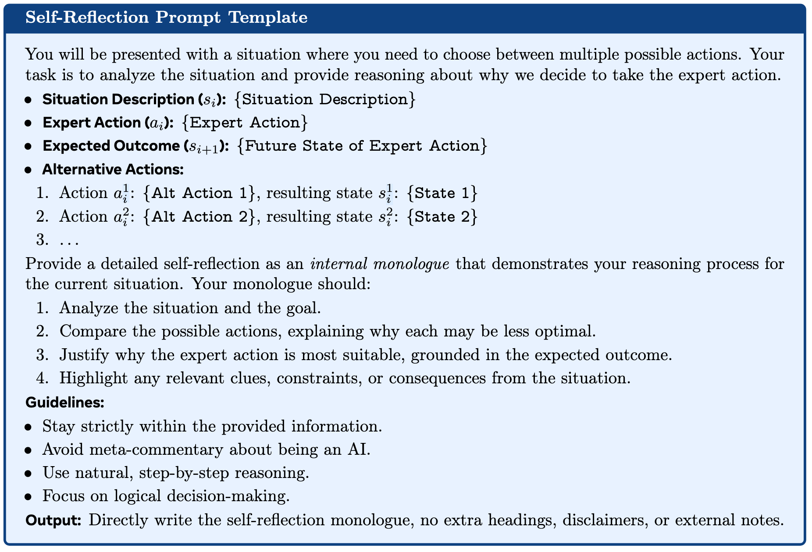

### 结果
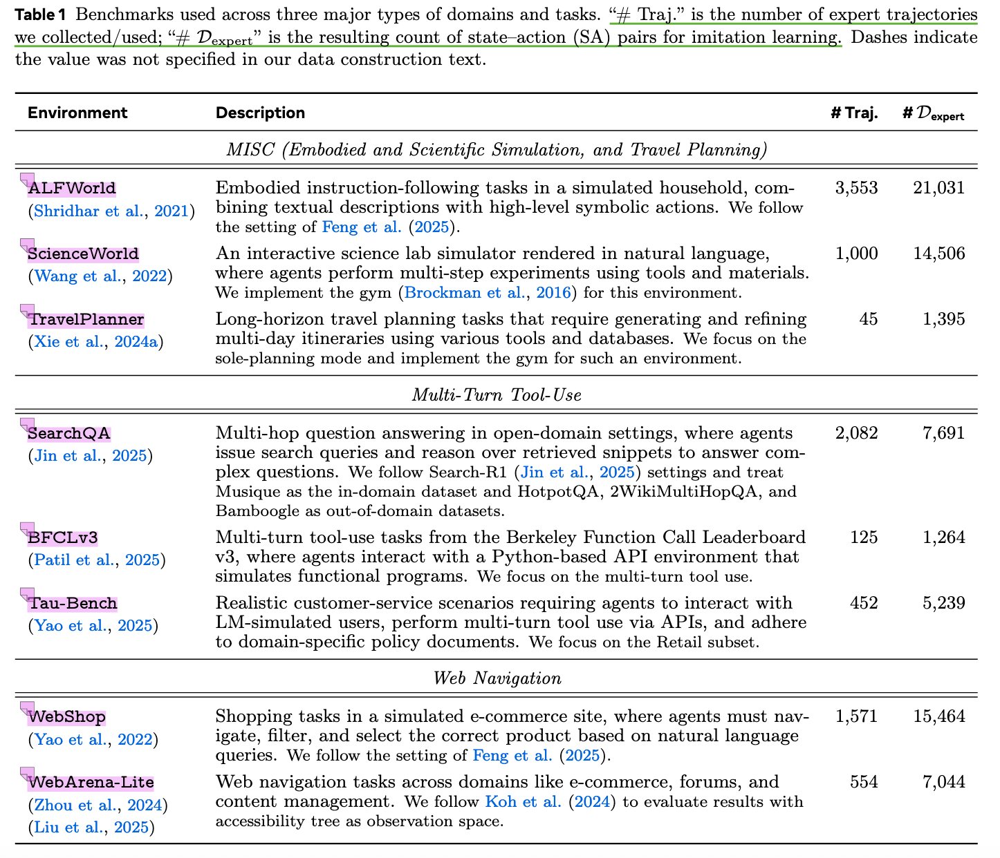

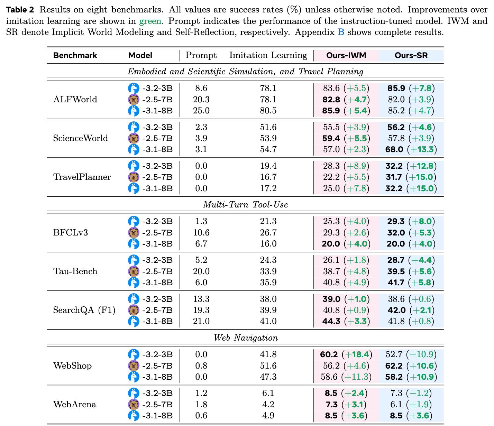

#### Overall Gains（总体收益）

在几乎所有环境与模型规模下，早期经验（Early Experience）均显著优于模仿学习（Imitation Learning）。  
- 隐式世界建模（Implicit World Modeling, IWM）在结构化模拟器与事务型环境中表现出稳定提升  
（ALFWorld/ScienceWorld 提升 +2.3 至 +5.5；WebShop 提升 +11.3 至 +18.4）。  
- 自我反思（Self-Reflection, SR）在需要多步推理与约束满足的任务中带来最大增益  
（TravelPlanner 提升 +12.8 至 +15.0；ScienceWorld +13.3；BFCLv3 在 3B 模型上 +8.0）。  
- 即使在最具挑战的环境下，增益虽较小但仍保持一致性（WebArena +1.2 至 +3.6；SearchQA +0.6 至 +3.3）。

---

#### Action-Space Perspective（行动空间视角）

在八个实验环境中，行动空间可划分为三类：

1. **封闭且有限的行动集**  
   如 ALFWorld（具身导航）、ScienceWorld（科学操作）与 TravelPlanner（行程规划）。  
   此类环境中，IWM 促使策略内化状态转移规律，而 SR 则对长程规划提供针对性修正  （例如 TravelPlanner 上 SR 提升显著）。

2. **结构化但规模较大的行动集**  
   如 BFCLv3（终端任务）与 Tau-Bench（多领域 API 调用）。  
   需要在多类型带参数的工具中正确选择与排序。  
   早期经验可减少工具误用并优化调用顺序；当错误主要源于逻辑推理时，SR 效果更优。

3. **开放式行动集**  
   如 SearchQA（自由搜索查询）与 WebArena（细粒度网页交互）。  
   其动作空间往往组合式、极大且复杂，是最具挑战的场景。  
   尽管困难，早期经验仍能通过将探索性 rollout 转化为稠密训练信号，实现稳定性能提升，无需外部奖励。

---

#### Observation-Space Perspective（观测空间视角）

基准环境覆盖了多层次的观测复杂度：

1. **低复杂度端**：  
  ALFWorld 提供简洁的场景文本描述；ScienceWorld 输出实验过程的程序化文本。

2. **中等复杂度端**：  
  BFCLv3 与 Tau-Bench 返回结构化的 API 架构与工具输出，需解析并正确排序。

3. **高复杂度端**：  
  WebArena 提供嘈杂、细粒度的网页状态（以可访问性树形式呈现），  
  需要在数百个类似 DOM 的元素间进行推理。

- 对于状态转移一致、可预测的环境（如 WebShop），IWM 帮助 Agent 内化环境动力学、提升下一状态预测；  
- 当失败主要源于推理错误或长程计划修复需求（如 TravelPlanner、ScienceWorld）时，SR 通过显式比较行为与专家轨迹获得更大提升。  
- 无论观测复杂度高低，早期经验方法均能将 Agent 的行为与结果状态转化为有效监督信号，从而在无奖励条件下提升策略学习效果。

---

#### Takeaway（核心结论）

早期经验（Early Experience）能够稳定地将 Agent 自身的行为及其后续状态转化为可扩展的监督信号，突破传统专家示范的局限。该范式下的两种方法均能在行动空间与观测复杂度显著不同的环境中强化策略表现。其效果在三种模型规模与三类环境中均得到验证，展现出强泛化性与可行性，证明早期经验范式在多环境中具有广泛适用性。

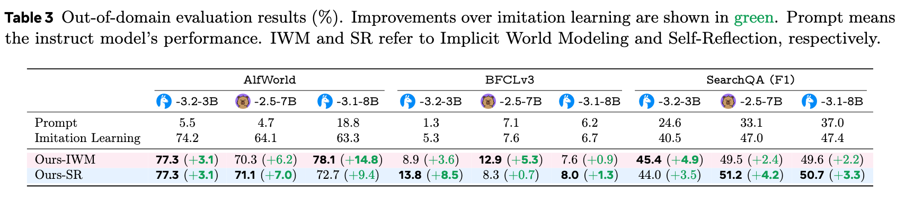

表 3 结果显示：
所有任务的 OOD 分数相比域内均有下降，但早期经验持续追回大部分差距。
在 SearchQA 等场景，OOD 相对增益甚至高于域内，表明将智能体自身 rollout 转为监督，可让策略应对演示未覆盖的状态。
方法趋势与域内一致：
IWM 在环境动态稳定时（ALFWorld）帮助最大；
SR 在工具缺失、参数变化等分布偏移下（BFCLv3）最强；
两者在检索分布发生变化的 SearchQA 上均有效，且适用于不同模型规模。
核心结论
早期经验显著提升智能体在多种 OOD 条件下的鲁棒性：IWM 擅长动态稳定场景，SR 擅长工具/参数/检索分布变化场景。


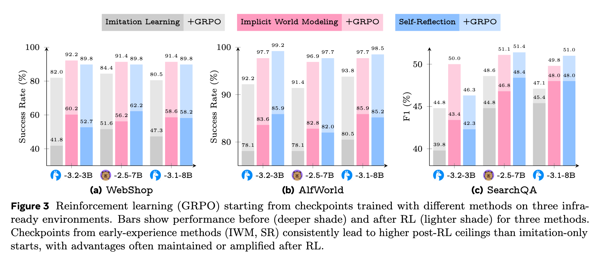

为评估在环境提供可验证奖励（即“经验时代”定义条件）后早期经验的影响，我们在第 5.2 节训练的模型上追加了强化学习阶段。
实验聚焦于三个具备奖励信号的基准任务：WebShop、ALFWorld 和 SearchQA，并采用广泛使用的 GRPO 算法（Shao et al., 2024），其超参数与训练步数完全与既有方案（Feng et al., 2025; Jin et al., 2025）保持一致。
唯一变化的因素是模型初始化方式：
	•	IL（模仿学习，Imitation Learning），
	•	IWM（隐式世界建模，Implicit World Modeling），
	•	SR（自我反思，Self-Reflection）。

图 3 的结果显示出明显规律：以早期经验为起点的模型在强化学习阶段始终达到更高的性能上限。
在部分环境中（如 ALFWorld），性能差距会随训练持续扩大；在另一些任务中差距略有收窄，但从未被反转。
即便在相同步数的奖励优化下，IL 初始化几乎从未能达到早期经验初始化的最终表现。

此外，我们还在未经过任何监督训练的原始预训练模型上直接运行 GRPO，结果在所有任务上均最差，且训练过程极不稳定，进一步强调了强初始化的重要性。

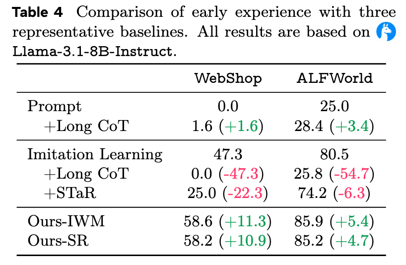
受 Test-time Scaling（Snell et al., 2024）启发，我们尝试让仅经过指令微调或模仿学习的模型，在推理时进行更深入的思维推理。  
- 基线：直接使用现有的指令微调模型及前人工作中使用的提示模板，通常产生较短的思维链（Wei et al., 2022）。  
- 改进：Long CoT 通过在训练集上进行更重的提示搜索，并在存在思维终止符（如 `</think>`）时截断，以鼓励持续生成更长的推理链。

基于 STaR（Zelikman et al., 2022），我们让模型为专家动作生成推理解释，并仅保留模型预测动作与专家一致的样本，得到 (state, rationale, action) 三元组进行微调。但由于该方法**未利用替代动作及其结果状态**，生成的推理解释缺乏环境落地性（ungrounded）。


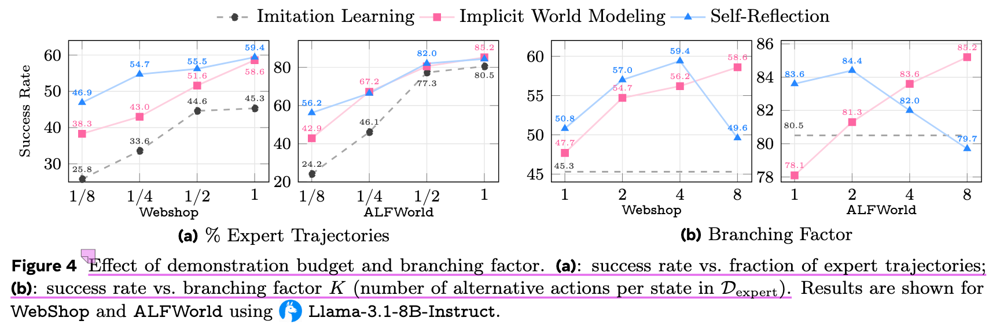

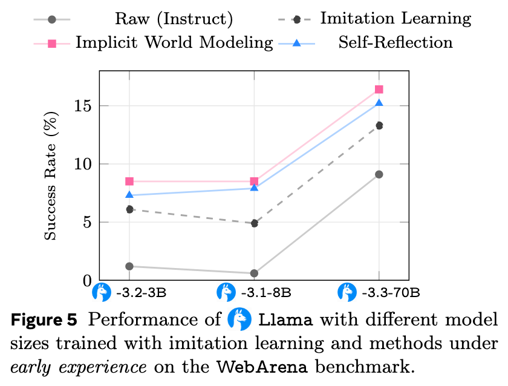

### 附录

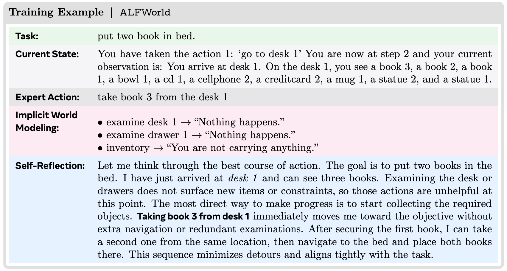

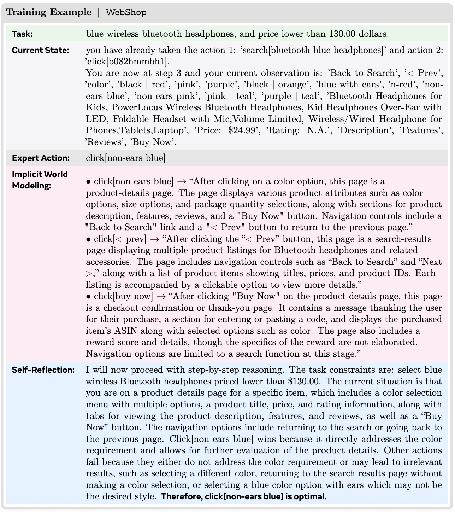

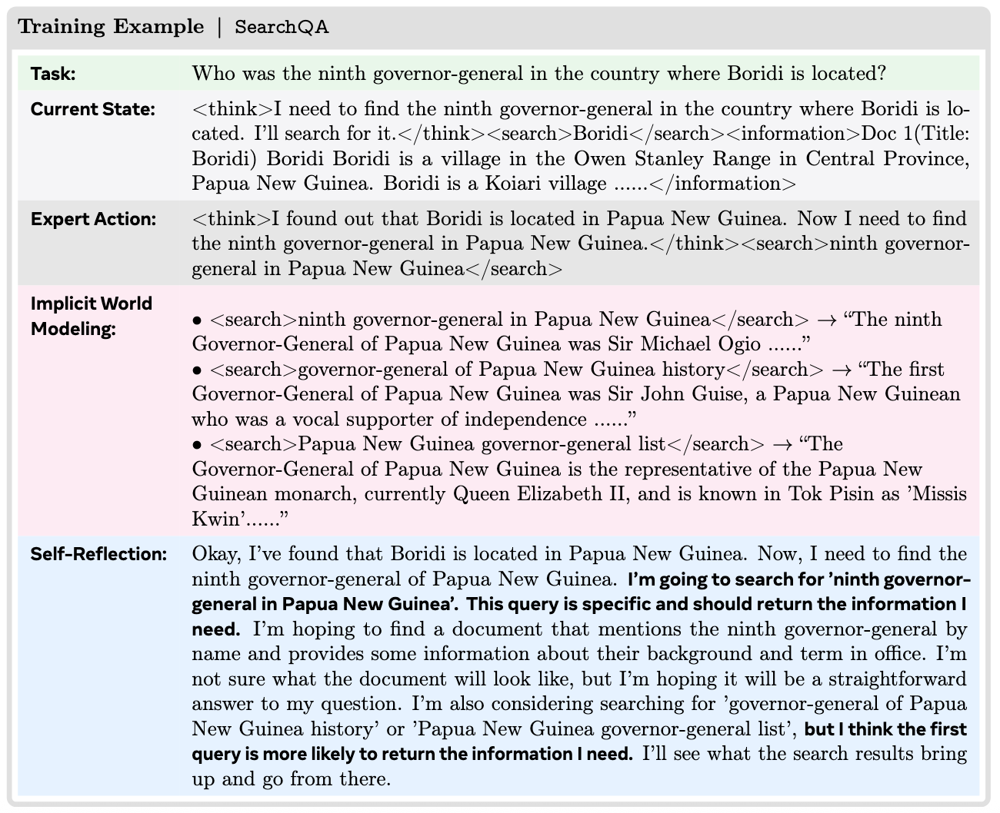

